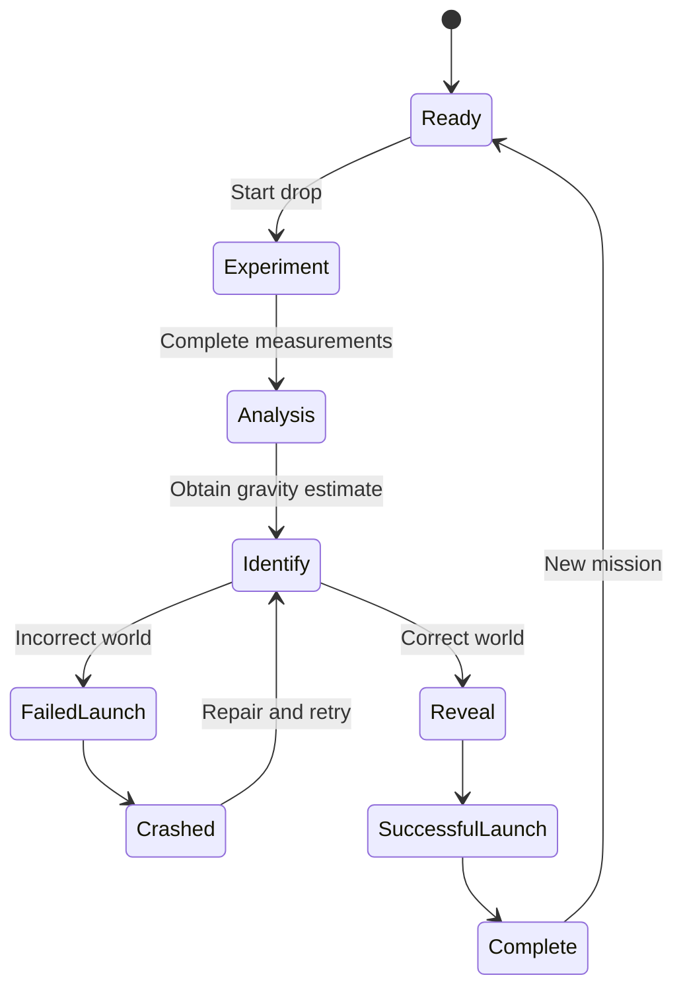

# Gravity Unknown — Product and Interaction Design

**Status:** Approved for implementation
**Current app:** `moon-experiment/`
**Target app:** `gravity-experiment/`
**Recommended title:** Gravity Unknown
**Tagline:** Measure the fall. Identify the world. Launch home.

## Approved compact-layout revision

This revision supersedes earlier layout and in-app catalog guidance:

- The wide desktop experience fits in one viewport without a product header card.
- The “All experiments” link is removed from the app.
- The world reference catalog is not shown; players use outside research to identify the world.
- Playback runs at real time with no speed control.
- Visible scene-action instructions are removed.
- The drop tower and observed-measurements table receive the freed vertical space.
- Mission status and New Mission remain available inside the compact navigation panel.
- Narrow screens retain a stacked, scrollable layout.

## 1. Product vision

Gravity Unknown turns the existing Moon Drop Experiment into a scientific identification game.

The player is stranded on an unidentified world. They measure a falling test mass, estimate the local gravitational acceleration, compare their estimate with a reference catalog, and program their spacecraft with the world they believe they are on.

A correct identification reveals the true result and allows the spacecraft to escape. An incorrect identification causes a failed launch and crash without revealing the answer.

## 2. Terminology

The five candidate bodies are moons, not planets:

- Io
- Earth’s Moon
- Ganymede
- Europa
- Callisto

The interface should use **world** as the general term. This is scientifically accurate and allows planets or other bodies to be added later.

Use:

- “Unknown world”
- “Which world are you on?”
- “World reference catalog”
- “World confirmed”

Avoid describing the candidates collectively as planets.

## 3. Primary goals

1. Preserve the existing falling-body measurement activity.
2. Randomly select one of five hidden worlds for each mission.
3. Make the player estimate gravity before identifying the world.
4. Keep the selected world and true result hidden until a correct guess.
5. Make success and failure visible through the spacecraft animation.
6. Allow recovery after an incorrect guess without changing the hidden world.
7. Remove Earth and other environmental clues from the scene.
8. Rename the app and directory from Moon Drop Experiment to Gravity Unknown.

## 4. Non-goals

The initial redesign does not need:

- User accounts
- Online leaderboards
- Persistent scores
- Three-dimensional graphics
- World-specific terrain before identification
- A physically destructive explosion
- Additional planets beyond the approved five moons

## 5. World data

Use the values from the supplied reference:

| World | Classification | Surface gravity |
|---|---|---:|
| Io | Moon of Jupiter | 1.80 m/s² |
| Earth’s Moon | Major Moon | 1.62 m/s² |
| Ganymede | Moon of Jupiter | 1.43 m/s² |
| Europa | Moon of Jupiter | 1.32 m/s² |
| Callisto | Moon of Jupiter | 1.24 m/s² |

The displayed reference values and revealed true values should use two decimal places.

The simulation should use these approved values consistently so the table, true line, and revealed gravity agree.

Suggested data representation:

```js
const WORLDS = Object.freeze([
  {
    id: "io",
    name: "Io",
    classification: "Moon of Jupiter",
    gravity: 1.8,
    aliases: ["io"],
  },
  {
    id: "earth-moon",
    name: "Earth’s Moon",
    classification: "Major Moon",
    gravity: 1.62,
    aliases: ["earth’s moon", "earth's moon", "earth moon", "moon", "the moon"],
  },
  {
    id: "ganymede",
    name: "Ganymede",
    classification: "Moon of Jupiter",
    gravity: 1.43,
    aliases: ["ganymede"],
  },
  {
    id: "europa",
    name: "Europa",
    classification: "Moon of Jupiter",
    gravity: 1.32,
    aliases: ["europa"],
  },
  {
    id: "callisto",
    name: "Callisto",
    classification: "Moon of Jupiter",
    gravity: 1.24,
    aliases: ["callisto"],
  },
]);
```

The selected world must remain unchanged through:

- Experiment resets
- Additional drops
- Missed measurements
- Incorrect guesses
- Spacecraft repair

Only **New Mission** selects another random world.

## 6. Core game loop



### Mission sequence

1. Start a new mission.
2. Select one hidden world with equal probability.
3. Show the neutral scene and reference catalog.
4. Let the player run the falling-body experiment.
5. Calculate and display the player’s estimated gravity.
6. Unlock the world-identification form.
7. Let the player enter a world name.
8. Evaluate the guess.
9. Run the corresponding spacecraft sequence.
10. Preserve or reveal information according to the result.

## 7. Information-reveal policy

### Before a correct identification

The interface may show:

- Player measurements
- Observed graph points
- Estimated or fitted line
- Estimated gravity
- Estimate uncertainty, if supported
- The five-world reference catalog
- Previous incorrect guesses

The interface must not show:

- Selected world name
- Selected world classification
- True gravity
- True theoretical graph line
- A true-line legend entry
- World-specific scenery
- Hidden answer text in normal DOM or accessibility labels

The selected answer must necessarily exist in JavaScript memory to run the simulation. This is not intended as protection against source inspection, but it must not leak through the normal interface.

### After an incorrect identification

Reveal only that the guess was incorrect.

Do not reveal:

- The correct world
- Whether the true gravity is higher or lower
- The true gravity
- The true line
- A narrowed list of possible answers

The player may repair the spacecraft, run another experiment, or submit another guess.

### After a correct identification

Reveal:

- Correct world name
- Classification
- True gravity
- Player estimate
- Absolute or percentage error
- True theoretical graph line
- Updated graph legend

The true line should animate or fade into the graph so the reveal is clear.

## 8. Layout

### Desktop

```text
┌───────────────────────────────────────────────────────────────┐
│ Gravity Unknown                        Mission / New Mission   │
│ Measure the fall. Identify the world. Launch home.            │
├───────────────────────────────────────────────────────────────┤
│                                                               │
│   Landed spacecraft                    Tower                  │
│          ◢                                │                   │
│   ───────────── neutral terrain ──────────│──── test mass     │
│                                                               │
├───────────────────────────────────────────────────────────────┤
│ Experiment status, drop controls, and measurement feedback    │
├────────────────────────────────┬──────────────────────────────┤
│ Measurement graph              │ Analysis                     │
│ • observed measurements        │ Estimated gravity            │
│ — estimated line               │ Trial count                  │
│ true line hidden               │ Run another trial            │
├────────────────────────────────┴──────────────────────────────┤
│ World Reference Catalog                                       │
│ Io · Earth’s Moon · Ganymede · Europa · Callisto              │
├───────────────────────────────────────────────────────────────┤
│ Which world are you on?                                       │
│ [ Enter a world name                         ] [Program Launch]│
└───────────────────────────────────────────────────────────────┘
```

### Mobile

Stack in this order:

1. Header and mission controls
2. Scene
3. Drop controls and experiment status
4. Estimate summary
5. Graph
6. World reference catalog
7. Identification form
8. Result and recovery controls

No part of the scene, graph, table, or form should produce horizontal page overflow.

## 9. Header and mission copy

### Initial state

**Title:** Gravity Unknown

**Tagline:** Measure the fall. Identify the world. Launch home.

**Mission status:** Unknown world

**Instructions:**

> Time each flash as the test mass falls. Use the resulting estimate of surface gravity to identify your location.

### After measurement

> Estimated surface gravity: **1.37 m/s²**
> Compare your estimate with the world catalog and program the launch computer.

If uncertainty is available:

> Estimated surface gravity: **1.37 ± 0.06 m/s²**

### Correct result

> **World confirmed: Ganymede**
> True gravity: **1.43 m/s²**
> Your estimate: **1.39 m/s²**
> Error: **2.8%**
> Navigation solution accepted. Launch successful.

### Incorrect result

> **Navigation mismatch**
> The programmed world does not match the observed gravity. The true location remains unknown.

### Crash recovery

Primary action:

> Repair and Try Again

Secondary action:

> Run Another Trial

## 10. World reference catalog

The catalog should be a semantic table with these columns:

- World
- Classification
- Surface gravity

The table remains visible while identifying the world.

Do not highlight the correct row before success.

After success, the correct row may receive a success treatment.

After failure, do not highlight or otherwise reveal the correct row. Previously guessed names may be shown separately as unsuccessful attempts.

## 11. Identification form

Label:

> Which world are you on?

Placeholder:

> Enter a world name

Submit button:

> Program Launch

Behavior:

- Keep the form disabled until a valid estimate has been produced.
- Trim leading and trailing whitespace.
- Match case-insensitively.
- Normalize straight and curly apostrophes.
- Accept approved aliases for Earth’s Moon.
- Show validation feedback for blank or unknown names without launching.
- Disable the form while a launch animation is running.
- Prevent repeated submission during animation.
- Optionally disable previously rejected guesses.

A datalist or accessible combobox may be used to reduce spelling frustration. The task is interpretation of the measurement, not exact spelling.

## 12. Scene redesign

### Environment

- Remove Earth from the sky.
- Remove text or imagery that identifies the current Moon.
- Use a generic dark star field.
- Keep the terrain visually neutral.
- Do not show Jupiter, Earth, or world-specific colors before success.
- Preserve the tower and existing falling-object interaction.

### Spacecraft

Place a small spacecraft on the ground to the left of the tower.

The craft should:

- Be visually secondary to the tower
- Be recognizable at desktop and mobile sizes
- Have a landed pose
- Support transform-based launch animations
- Include an engine flame or glow state
- Include a crashed or hard-landed pose
- Avoid requiring a new external rendering dependency

An inline SVG or existing scene primitives are preferred.

## 13. Successful launch animation

Sequence:

1. Correct result is confirmed.
2. True gravity and true line appear.
3. Spacecraft engine begins glowing.
4. Craft lifts vertically.
5. Craft tilts slightly.
6. Craft accelerates upward and away.
7. Craft fades or exits the scene.
8. Success message and **New Mission** remain available.

Target duration: approximately 2–3 seconds.

The spacecraft should fully disappear after a successful launch.

## 14. Failed launch and crash animation

Sequence:

1. Incorrect result is confirmed.
2. True information remains hidden.
3. Spacecraft engine starts.
4. Craft lifts a short distance.
5. Engine sputters or the craft loses attitude.
6. Craft follows a short downward arc.
7. Craft lands or crashes onto the terrain.
8. Show a small dust plume or impact motion.
9. Present repair and retry controls.

Avoid an explosion. A hard landing keeps the tone playful and avoids unnecessary visual violence.

The world and all collected data remain unchanged after the crash.

## 15. Multiple experiments and fairness

Europa and Callisto differ by only `0.08 m/s²`. A single reaction-time trial may not reliably distinguish them.

The app should allow the player to run another drop before or after an incorrect guess.

Preferred behavior:

- Preserve the hidden world.
- Preserve previous trial summaries.
- Aggregate compatible measurements into an improved estimate.
- Show trial count.
- Show uncertainty if the current analysis supports it.
- Allow the player to decide when to guess.

If full aggregation would require destabilizing the existing model, the minimum acceptable version is:

- Allow repeated trials on the same hidden world.
- Replace the current estimate with the latest completed trial.
- Clearly label the trial number.

## 16. Accessibility

- Use an `aria-live` region for experiment completion, correct answers, incorrect answers, crash completion, and successful launch.
- Do not communicate success or failure through color alone.
- Keep the reference catalog as a semantic table.
- Give the world input a visible label.
- Keep keyboard focus on meaningful controls after animations.
- After a failed launch, move focus to the recovery message or repair action.
- After a successful launch, move focus to the revealed result or New Mission button.
- Ensure all controls have visible focus treatment.
- Preserve sufficient contrast.

### Reduced motion

Respect `prefers-reduced-motion`.

With reduced motion:

- Successful launch may use a short fade or immediate escaped state.
- Failed launch may switch directly to the crashed pose.
- All information and controls must remain equivalent.

## 17. Homepage changes

Rename the homepage card from:

> Moon Drop Experiment

to:

> Gravity Unknown

Recommended description:

> Measure a falling probe, estimate local gravity, identify the hidden moon, and launch home.

Update the link from:

```text
moon-experiment/
```

to:

```text
gravity-experiment/
```

Replace the Moon emoji placeholder with a preview of the redesigned neutral scene showing:

- Spacecraft on the left
- Tower
- Falling test mass
- Neutral sky with no Earth

## 18. Completion criteria

The redesign is complete when:

1. `moon-experiment/` has been renamed to `gravity-experiment/`.
2. The app and homepage use the title Gravity Unknown.
3. Every new mission selects one of the five approved worlds.
4. Simulation gravity comes from the selected world.
5. Resetting or repeating a trial does not reroll the world.
6. The player obtains an estimate before guessing.
7. The catalog displays all five approved values.
8. Blank and invalid names do not trigger launch.
9. Incorrect guesses trigger the failed launch and crash.
10. Incorrect guesses do not reveal the true world, gravity, or line.
11. The player can recover and try again after a crash.
12. Correct guesses reveal the true world, gravity, and graph line.
13. Correct guesses trigger takeoff and disappearance.
14. Earth has been removed from the sky.
15. The spacecraft is positioned left of the tower.
16. The app works with reduced motion.
17. Desktop and mobile layouts have no page overflow.
18. The homepage card links to the renamed directory.
19. Existing measurement behavior remains functional.
20. Tests and browser validation pass.
